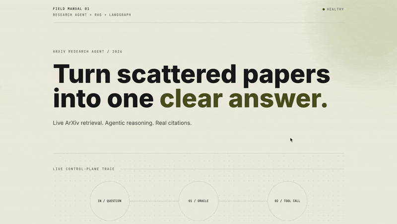
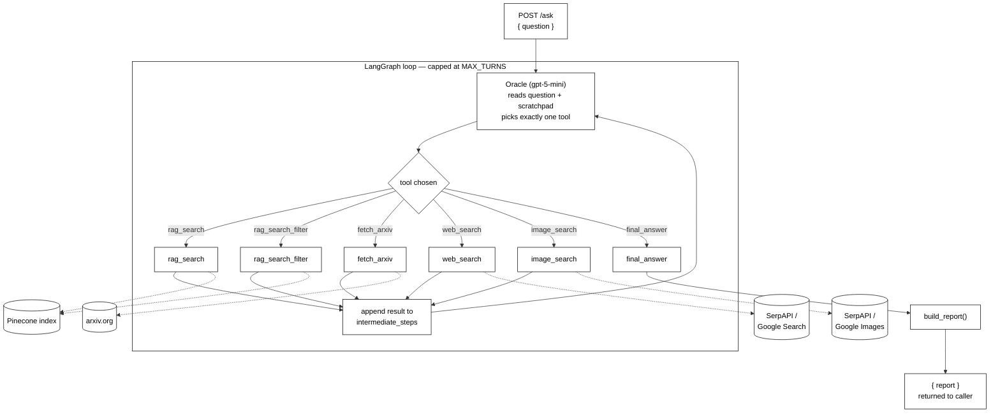

# ArXiv Research Agent

An agentic research assistant powered by LangGraph, RAG (Pinecone), and live ArXiv/web search.
You give it a research question and it decides on its own whether to search a custom knowledge base, fetch a specific paper or search the live web then returns a synthesized, cited report.

[](./demo.gif)

The project includes:

- A FastAPI backend (`main.py`)
- A LangGraph agent orchestration loop
- A RAG knowledge base built from ingested ArXiv papers (Pinecone)
- A React frontend, built with Lovable, calling the backend directly

## Architecture



A single LLM ("the oracle") repeatedly picks a tool, reads the result, and decides again — looping until it calls `final_answer` or hits `MAX_TURNS`. `build_report()` then formats that final answer into the returned report string.

### Tools

| Tool                | Purpose                                                                       |
| ------------------- | ----------------------------------------------------------------------------- |
| `rag_search`        | Semantic search over the full Pinecone knowledge base                         |
| `rag_search_filter` | Semantic search restricted to one specific `arxiv_id`                         |
| `fetch_arxiv`       | Direct scrape of a paper's abstract from arxiv.org, given its ID              |
| `web_search`        | Live Google search via SerpAPI, for anything outside the knowledge base       |
| `image_search`      | Live Google Images search via SerpAPI, as a fallback for illustrative figures |
| `final_answer`      | Structured schema the oracle fills to produce the report and end the loop     |

## Quick Start (Local)

### 1. Prerequisites

- Python 3.12
- OpenAI API key
- Pinecone API key (with an existing populated index — see `notebooks/`)
- SerpAPI key

### 2. Environment

```
cp .env.example .env
```

```
OPENAI_API_KEY=your_key_here
PINECONE_API_KEY=your_key_here
SERPAPI_KEY=your_key_here
```

### 3. Install Dependencies

```
python3 -m venv .venv
source .venv/bin/activate
pip install -r requirements.txt
```

### 4. Run Backend

```
uvicorn main:app --reload
```

Backend URL: `http://localhost:8000`
Interactive docs: `http://localhost:8000/docs`

## Run With Docker

```
docker build -t arxiv-research-agent .
docker run -p 8000:8000 --env-file .env arxiv-research-agent
```

## Building the Knowledge Base

The API connects to an **existing** Pinecone index — it does not build one at request time.

To build your own, run `notebooks/research_agent.ipynb`: fetch papers from ArXiv → download PDFs → chunk text (`RecursiveCharacterTextSplitter`) → embed chunks (`text-embedding-3-small`) → upsert to a Pinecone serverless index.

## Project Pointers

- `main.py`: tool definitions, oracle (decision LLM), LangGraph agent, `/ask` endpoint
- `notebooks/research_agent.ipynb`: knowledge base ingestion pipeline
- `Dockerfile`: container definition, Python 3.12 slim base
- `requirements.txt`: backend dependencies
